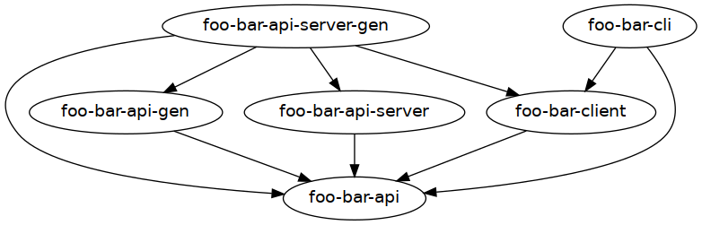

# API Server with CLI Template

This is a template implementation of an API server with an example command-line tool to go along with it.
It features complete option parsing, like in [template-optparse](https://github.com/NorfairKing/template-optparse), a command-line tool like in [template-cli](https://github.com/NorfairKing/template-cli) as well as  handlers, testing and best-practices.

* Haskell code for an api-server
* Per-route integration tests for the api-server
* Haskell code for an accompanying command-line tool
* Per-command integration test for the cli tool
* Option parsing & Option parsing tests for both the server and the cli tool
* Nix build
* NixOS module for hosting the server
* Nix home manager module for using the client with automated syncing
* CI
  * Stack-based CI
  * Nix-based CI
* Pre-commit hooks
  * ormolu
  * hlint
  * nixpkgs-fmt

## License

This template is **not** free to use.
See https://template.cs-syd.eu/template/NorfairKing/template-api-server-with-auth-and-cli for more information.

Copyright (c) 2020 Tom Sydney Kerckhove.

All Rights Reserved.

## Instructions

To use this template in a new project, choose the name for your project, for example `homeless-shelter`.
Then use [template-filler](https://github.com/NorfairKing/template-filler) to use the template, like this:

```
template-filler --source /path/to/this/template-api-server-with-auth-and-cli --destination /path/to/your/homeless-shelter --find FooBar --replace HomelessShelter
```

### Template overview

This template contains these haskell packages and notable modules:

- `foo-bar-api`: The API, as a `servant`-based type definition, and related data types.
  - `Foo/Bar.API.Data`: The API data type definitions
  - `Foo/Bar.API`: The API Type definition
- `foo-bar-api-gen`: The generators and tests for the API and its data types.
  - `FooBar.API.Data.Gen`: Generators for the API data types
- `foo-bar-api-server`: The API server that implements this API.
  - `Foo/Bar.API.Server.OptParse`: Option parsing
  - `Foo/Bar.API.Server.Env`: The (read-only) environment and related functions
  - `Foo/Bar.API.Server.Handler.<CommandName>`: One module per command of the CLI.
- `foo-bar-api-server-gen`: The generators and tests for the API server.
  - `Foo/Bar.API.Server.TestUtils`: Utility functions to write tests that use the API server
  - `Foo/Bar.API.Server.Handler.<CommandName>Spec`: One module per handler containing its tests
- `foo-bar-client`: The client record of functions to call the API server.
  - The `Foo/Bar.Client.foo-barClient` record.
- `foo-bar-cli`: An example command-line tool to call the API server.
  - `Foo/Bar.CLI.OptParse`: Option parsing
  - `Foo/Bar.CLI.Env`: The (read-only) environment and related functions
  - `Foo/Bar.CLI.Command.<CommandName>`: One module per command of the CLI.




### OptParse

The option parsing for both `foo-bar-cli` and `foo-bar-api-server` is based on [the option parsing template](https://github.com/NorfairKing/template-optparse).
It is included in this template so you will not need to also buy the option parsing template.

For more information about how to use the option parsing, follow the instructions in `template-cli/src/Foo/Bar/Cli/OptParse.hs`.

### Nix build

If you don't need a nix build, remove these files:

```
rm -rf *.nix nix .github/workflows/nix.yaml
```

In `nix/nixpkgs-version.nix`, we pin a `nixpkgs` commit.
In `nix/pkgs.nix` we define our own 'version' of the `nixpkgs` by adding our own overlays.
The project overlay is defined in `nix/overlay.nix`.

In `nix/nixos-module.nix`, we define a nixos module for hosting the sync server.
In `nix/home-manager-module.nix`, we define a nix home manager module for using the project on NixOS with automatic syncing.
In `nix/nixos-module-test.nix`, both of those are tested. This test is not run on CI because GitHub actions does not support it.

See the instructions in `nix/overlay.nix` for more details.

### CI

CI is set up for both a stack build and a nix build.
See `.github/workflows` for more details.

The stack build should "just work".

For the nix build to work, there is a manual step that you need to go through:
First, make a cachix cache at cachix.org.
Put its name in the right places within `.github/workflows/nix.yaml`.
Then put its signing key in the 'Secrets' part of your repository on github.

### Workflow examples

#### Adding an endpoint to the API

1. Add the endpoint in `foo-bar-api/src/Foo/Bar/API.hs`.
2. Add a handler module in `foo-bar-api-server/src/Foo/Bar/API/Server/Handler/<RouteName>hs` with a function as follows:

   ```
   handle<RouteName> :: H ()
   ```

   Give it a type according to the endpoint type.
   If it requires authentication, add `AuthCookie` as the first argument.

3. Hook up the handler in the `foo-barHandlers` record in `foo-bar-api-server/src/Foo/Bar/API/Server.hs`.

   If the endpoint requires authentication, use the `protected` combinator.

4. Add tests in `foo-bar-api-server-gen/test/Foo/Bar/API/Server/Handler/<RouteName>Spec.hs`

#### Adding a command to the CLI tool

1. Add the new command's option parsing in the `Foo/Bar.CLI.OptParse` module according to the instructions within.

2. Add a `Foo/Bar.CLI.Command.<CommandName>` module with a function as follows:

   ```
   commandName :: CommandNameSettings -> C ()
   ```

3. Add a case to the `dispatch` function in `Foo/Bar.CLI`.
4. Add tests in `Foo/Bar.CLI.Command.<CommandName>Spec`.

